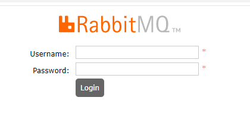
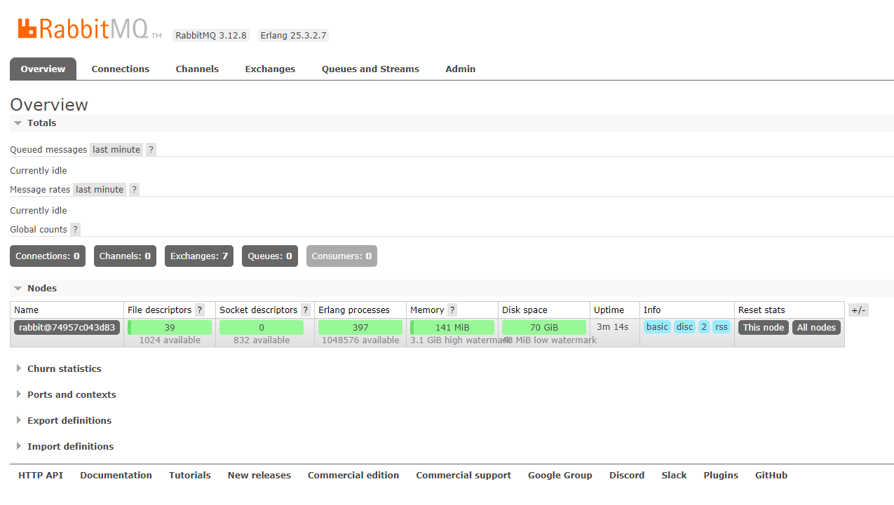
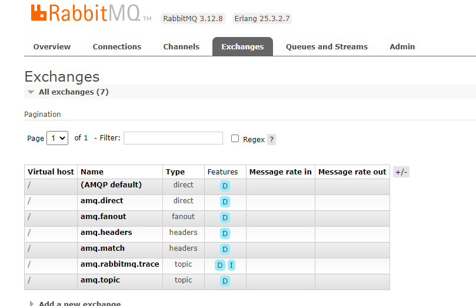
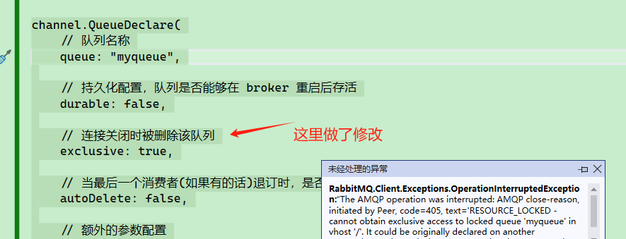

# RabbitMQ 教程

作者：痴者工良

作者博客地址：https://www.whuanle.cn

[TOC]


## RabbitMQ 简介

RabbitMQ 是一个实现了 AMQP 协议的消息队列，AMQP 被定义为作为消息传递中间件的开放标准的应用层协议。它代表高级消息队列协议，具有消息定位、路由、队列、安全性和可靠性等特点。

目前社区上比较流行的消息队列有 kafka、ActiveMQ、Pulsar、RabbitMQ、RocketMQ 等。


RabbitMQ 的优点、用途等，大概是可靠性高、灵活的路由规则配置、支持分布式部署、遵守 AMQP 协议等。可以用于异步通讯、日志收集(日志收集还是 Kafka 比较好)、事件驱动架构系统、应用通讯解耦等。


RabbitMQ 社区版本的特点如下：

* 支持多种消息传递协议、消息队列、传递确认、灵活的队列路由、多种交换类型(交换器)。

* 支持 Kubernetes 等分布式部署，提供多种语言的 SDK，如 Java、Go、C#。
* 可插入的身份验证、授权，支持 TLS 和 LDAP。
* 支持持续集成、操作度量和与其他企业系统集成的各种工具和插件。
* 提供一套用于管理和监视 RabbitMQ 的 HTTP-API、命令行工具和 UI。


RabbitMQ 的基本对象有以下几点，但是读者现在并不需要记住，在后面的章节中，笔者将会逐个介绍。

- **生产者（Producer）**：推送消息到 RabbitMQ 的程序。
- **消费者（Consumer）**：从 RabbitMQ 消费消息的程序。
- **队列（Queue）**：RabbitMQ 存储消息的地方，消费者可以从队列中获取消息。
- **交换器（Exchange）**：接收来自生产者的消息，并将消息路由到一个或多个队列中。
- **绑定（Binding）**：将队列和交换器关联起来，当生产者推送消息时，交换器将消息路由到队列中。
- **路由键（Routing Key）**：用于交换器将消息路由到特定队列的匹配规则。


RabbitMQ 的技术知识点大概分为：

- 用户和权限：配置用户、角色和其对应的权限。
- Virtual Hosts：配置虚拟主机，用于分隔不同的消息队列环境。
- Exchange 和 Queue 的属性：配置交换器和队列的属性，比如持久化、自动删除等。
- Policies：定义策略来自动设置队列、交换器和链接的参数。
- 连接和通道：配置连接和通道的属性，如心跳间隔、最大帧大小等。
- 插件：启用和配置各种插件，如管理插件、STOMP 插件等。
- 集群和高可用性：配置集群和镜像队列，以提供高可用性。
- 日志和监控：配置日志级别、目标和监控插件。
- 安全性：配置 SSL/TLS 选项、认证后端等安全相关的设置。


由于笔者技术有限以及篇幅限制，本文只讲解与 C# 编程相关的技术细节，从中了解 RabbitMQ 的编码技巧和运作机制。


## 安装与配置

### 安装 RabbitMQ

读者可以在 RabbitMQ 官方文档中找到完整的安装教程：https://www.rabbitmq.com/download.html


本文使用 Docker 的方式部署。

RabbitMQ 社区镜像列表：https://hub.docker.com/_/rabbitmq

创建目录用于映射存储卷：

```bash
mkdir -p /opt/lib/rabbitmq
```

部署容器：

```bash
docker run -itd --name rabbitmq -p 5672:5672 -p 15672:15672 \
-v /opt/lib/rabbitmq:/var/lib/rabbitmq \
rabbitmq:3.12.8-management
```


部署时占用两个端口。5672 是 MQ 通讯端口，15672 是 Management UI 工具端口。


打开 15672 端口，会进入 Web 登录页面，默认账号密码都是 guest。





> 关于 RabbitMQ Management UI 的使用方法，后续再介绍。


打开管理界面后会，在 `Exchanges` 菜单中，可以看到如下图表格。这些是默认的交换器。现在可以不需要了解这些东西，后面会有介绍。

| Virtual host | Name               | Type    | Features |
| :----------- | :----------------- | :------ | :------- |
| /            | (AMQP default)     | direct  | D        |
| /            | amq.direct         | direct  | D        |
| /            | amq.fanout         | fanout  | D        |
| /            | amq.headers        | headers | D        |
| /            | amq.match          | headers | D        |
| /            | amq.rabbitmq.trace | topic   | D I      |
| /            | amq.topic          | topic   | D        |




## 发布与订阅模型

使用 C# 开发 RabbitMQ，需要使用 nuget 引入 RabbitMQ.Client，官网文档地址：[.NET/C# RabbitMQ Client Library — RabbitMQ](https://www.rabbitmq.com/dotnet.html)

**在继续阅读文章之前，请先创建一个控制台程序。**


### 生产者、消费者、交换器、队列

为了便于理解，本文制作了几十张图片，约定一些图形表示的含义：


对应生产者，使用如下图表示：


对于消费者，使用如下图表示：


对于消息队列，使用如下图表示：


对于交换器，使用如下图表示：


在 RabbitMQ 中，生产者发布的消息是不会直接进入到队列中，而是经过交换器(Exchange) 分发到各个队列中。前面提到，部署 RabbitMQ 后，默认有 七个交换器，如 `(AMQP default)`、`amq.direct` 等。

当然，对于现在来说，我们不需要了解交换器，所以，在**本节的教程中**，会使用默认交换器完成实验。


在**忽略交换器存在**的情况下，我们可以将生产和消费的流程简化如下图所示：


> 请一定要注意，图中省略了交换器的存在，因为使用的是默认的交换器。但是**生产者推送消息必须是推送到交换器，而不是队列**，<span style="color:red;">这一句一定要弄清楚</span>。


对于消费者来说，要使用队列，必须确保队列已经存在。

使用 C# 声明(创建)一个队列的代码和参数如下所示：

```csharp
// 声明一个队列
channel.QueueDeclare(
	// 队列名称
	queue: "myqueue",

	// 持久化配置，队列是否能够在 broker 重启后存活
	durable: false,

	// 连接关闭时被删除该队列
	exclusive: false,

	// 当最后一个消费者(如果有的话)退订时，是否应该自动删除这个队列
	autoDelete: false,

	// 额外的参数配置
	arguments: null
	);
```


完整代码示例：

```csharp

ConnectionFactory factory = new ConnectionFactory
{
	HostName = "localhost"
};

// 连接
using IConnection connection = factory.CreateConnection();

// 通道
using IModel channel = connection.CreateModel();

channel.QueueDeclare(
	// 队列名称
	queue: "myqueue",

	// 持久化配置，队列是否能够在 broker 重启后存活
	durable: false,

	// 连接关闭时被删除该队列
	exclusive: false,

	// 当最后一个消费者(如果有的话)退订时，是否应该自动删除这个队列
	autoDelete: false,

	// 额外的参数配置
	arguments: null
	);
```


- `queue`：队列的名称。

- `durable`：设置是否持久化。持久化的队列会存盘，在服务器重启的时候可以保证不丢失相关信息。

- `exclusive` 设置是否排他。如果一个队列被声明为排他队列，**该队列仅对首次声明它的连接可见**，并在连接断开时自动删除。

- > 该配置是基于 IConnection 的，同一个 IConnection 创建的不同通道 (IModel) ，也会遵守此规则。

- `autoDelete`：设置是否自动删除。自动删除的前提是至少有一个消费者连接到这个队列，之后所有与这个队列连接的消费者都断开时，才会自动删除。

- `argurnents`: 设置队列的其他一些参数，如队列的消息过期时间等。


如果队列已经存在，不需要再执行 `QueueDeclare()`。重复调用 `QueueDeclare()`，如果参数相同，不会出现副作用，已经推送的消息也不会出问题。

但是，如果 `QueueDeclare()` 参数如果跟已存在的队列配置有差异，则可能会报错。



> 一般情况下，为了合理架构和可靠性，会由架构师等在消息队列中提前创建好交换器、队列，然后客户端直接使用即可。一般不让程序启动时设置，这样会带来很大的不确定性和副作用。


生产者发送消息时的代码也很简单，**指定要发送到哪个交换器或路由**中即可。

> 请一定要注意，RabbitMQ 生产者发送消息，推送到的是交换器，而不是直接推送到队列！

```csharp
channel.BasicPublish(

	// 使用默认交换器
	exchange: string.Empty,

	// 推送到哪个队列中
	routingKey: "myqueue",

	// 队列属性
	basicProperties: null,

	// 要发送的消息需要先转换为 byte[]
	body: Encoding.UTF8.GetBytes("测试")
	);
```


`BasicPublish` 有三个重载：

```csharp
BasicPublish(
    PublicationAddress addr, 
    IBasicProperties basicProperties, 
    ReadOnlyMemory<byte> body)
```

```csharp
BasicPublish(string exchange, 
             string routingKey, 
             IBasicProperties basicProperties, 
             ReadOnlyMemory<byte> body)
```

```csharp
BasicPublish(string exchange, 
             string routingKey, 
             bool mandatory = false, 
             IBasicProperties basicProperties = null, 
             ReadOnlyMemory<byte> body = default)
```


- `exchange`： 交换器的名称，如果留空则会推送到默认交换器。
- `routingKey`： 路由键，交换器根据路由键将消息存储到相应的队列之中。
- `basicProperties`：消息属性，如过期时间等。
- `mandatory`：值为 false 时，如果交换器没有绑定合适的队列，则**该消息会丢失**。值为 true 时，如果交换器没有绑定合适的队列，则会触发`IModel.BasicReturn` 事件。


`IBasicProperties basicProperties` 参数是接口，我们可以使用 `IModel.CreateBasicProperties()` 创建一个接口对象。

`IBasicProperties ` 接口中封装了很多属性，使得我们不需要使用字符串的显示传递配置。

`IBasicProperties ` 其完整属性如下：

```csharp
// 标识应用程序的 ID
public String AppId { set; get; }

// 标识集群的 ID
public String ClusterId { set; get; }

// 指定消息内容的编码方式，例如 "utf-8"
public String ContentEncoding { set; get; }

// 指定消息内容的 MIME 类型，例如 "application/json"
public String ContentType { set; get; }

// 用于关联消息之间的关系，通常用于 RPC（远程过程调用）场景
public String CorrelationId { set; get; }

// 指定消息的持久化方式，值 1：不持久化，值 2：持久化
public Byte DeliveryMode { set; get; }

// 单位毫秒，指定该消息的过期时间
public String Expiration { set; get; }

// 自定义消息的头部信息
public IDictionary`2 Headers { set; get; }

// 指定消息的唯一标识符
public String MessageId { set; get; }

// 是否持久化
public Boolean Persistent { set; get; }

// 指定消息的优先级，范围从 0 到 9
public Byte Priority { set; get; }

// 指定用于回复消息的队列名称
public String ReplyTo { set; get; }

// 指定用于回复消息的地址信息
public PublicationAddress ReplyToAddress { set; get; }

// 指定消息的时间戳
public AmqpTimestamp Timestamp { set; get; }

// 消息的类型
public String Type { set; get; }

// 标识用户的 ID
public String UserId { set; get; }
```


推送消息时，可以对单个消息细粒度地设置 IBasicProperties ：

```csharp
using IConnection connection = factory.CreateConnection();
using IModel channel = connection.CreateModel();

// 创建两个队列
channel.QueueDeclare(queue: "q1", durable: false, exclusive: false, autoDelete: false);

var properties = channel.CreateBasicProperties();
// 示例 1：
properties.Persistent = true;
properties.ContentType = "application/json";
properties.ContentEncoding = "UTF-8";

// 示例 2：
//properties.Persistent = true;
//properties.ContentEncoding = "gzip";
//properties.Headers = new Dictionary<string, object>();

channel.BasicPublish(
	exchange: string.Empty,
	routingKey: "q1",
	basicProperties: properties,
	body: Encoding.UTF8.GetBytes($"测试{i}")
);
```


对于 IBasicProperties 的使用，文章后面会有更加详细的介绍。


现在，我们推送了 10 条消息到队列中，然后在 Management UI 中观察。

```csharp
int i = 0;
while (i < 10)
{
	channel.BasicPublish(
	exchange: string.Empty,
	routingKey: "myqueue",
	basicProperties: null,
	body: Encoding.UTF8.GetBytes($"测试{i}")
	);
	i++;
}
```


我们可以在 UI 的 Queues and Streams 中看到当前所有的队列。


> 可以看到当前队列中的 `Ready` 状态 `Unacked`  状态的消息数，分别对应上文中的等待投递给消费者的消息数和己经投递给消费者但是未收到确认信号的消息数


点击该队列后，会打开如下图所示的界面。


首先看 Overview。


Ready 指还没有被消费的消息数量。

Unacked 指消费但是没有 ack 的消息数量。


另一个 Message rates 图表，指的是发布、消费消息的速度，因为不重要，因此这里不说明。


在 Bindings 中，可以看到该队列绑定了默认的交换器。


然后编写一个消费者，消费该队列中的消息，其完整代码如下：

```csharp
using RabbitMQ.Client;
using RabbitMQ.Client.Events;
using System.Text;

ConnectionFactory factory = new ConnectionFactory
{
	HostName = "localhost"
};

using IConnection connection = factory.CreateConnection();
using IModel channel = connection.CreateModel();

channel.QueueDeclare(
	// 队列名称
	queue: "myqueue",

	// 持久化配置，队列是否能够在 broker 重启后存活
	durable: false,

	// 连接关闭时被删除该队列
	exclusive: false,

	// 当最后一个消费者(如果有的话)退订时，是否应该自动删除这个队列
	autoDelete: false,

	// 额外的参数配置
	arguments: null
	);

// 定义消费者
var consumer = new EventingBasicConsumer(channel);
consumer.Received += (model, ea) =>
{
	var message = Encoding.UTF8.GetString(ea.Body.Span);
	Console.WriteLine($" [x] Received {message}");
};

// 开始消费
channel.BasicConsume(queue: "myqueue",
					 autoAck: true,
					 consumer: consumer);

Console.ReadLine();
```


> 注意，如果填写了一个不存在的队列，那么程序会报异常。
>
> 


在消费者程序未退出前，即 IConnection 未被 `Dispose()` 之前，可以在 Consumers 中看到消费者客户端程序信息。 


那么，如果我们只消费，不设置自动 ack 呢？

将消费者代码改成：

```csharp
channel.BasicConsume(queue: "myqueue",
					 autoAck: false,
					 consumer: consumer);
```


完整代码如下：

```csharp
using RabbitMQ.Client;
using RabbitMQ.Client.Events;
using System.Text;

ConnectionFactory factory = new ConnectionFactory
{
	HostName = "localhost"
};

using IConnection connection = factory.CreateConnection();
using IModel channel = connection.CreateModel();

channel.QueueDeclare(
	queue: "myqueue",
	durable: false,
	exclusive: false,
	autoDelete: false,
	arguments: null
	);

int i = 0;
while (i < 10)
{
	channel.BasicPublish(
	exchange: string.Empty,
	routingKey: "myqueue",
	basicProperties: null,
	body: Encoding.UTF8.GetBytes($"测试{i}")
	);
	i++;
}

// 定义消费者
var consumer = new EventingBasicConsumer(channel);
consumer.Received += (model, ea) =>
{
	var message = Encoding.UTF8.GetString(ea.Body.Span);
	Console.WriteLine($" [x] Received {message}");
};

// 开始消费
channel.BasicConsume(queue: "myqueue",
					 autoAck: false,
					 consumer: consumer);

Console.ReadLine();
```


此时会发现，所有的消息都已经读了，但是 Unacked 为 10。


如下图所示，`autoAck: false` 之后，如果重新启动程序(只消费，不推送消息)，那么程序会继续重新消费一遍。

对于未 ack 的消息，消费者重新连接后，RabbitMQ 会再次推送。


与 Kafka 不同的是，Kafka 如果没有 ack 当前消息，则服务器会自动重新发送该条消息给消费者，如果该条消息未完成，则会一直堵塞在这里。而对于 RabbitMQ，未被 ack 的消息会被暂时忽略，自动消费下一条。所以基于这一点，**默认情况下，RabbitMQ 是不能保证消息顺序性**。


当然， RabbitMQ 是很灵活的，我们可以选择性地消费部分消息，避免当前消息阻塞导致程序不能往下消费：

```csharp
	// 定义消费者
	int i = 0;
	var consumer = new EventingBasicConsumer(channel);
	consumer.Received += (model, ea) =>
	{
		var message = Encoding.UTF8.GetString(ea.Body.Span);
		Console.WriteLine($" [x] Received {message}");
		i++;
        // 确认该消息被正确消费
		if (i % 2 == 0)
			channel.BasicAck(deliveryTag: ea.DeliveryTag, multiple: false);
	};

	// 开始消费
	channel.BasicConsume(queue: "myqueue",
						 autoAck: false,
						 consumer: consumer);
```


在某些场景下，这个特性很有用，我们可以将多次执行失败的消息先放一放，转而消费下一条消息，从而避免消息堆积。


### 多工作队列

如果同一个队列的不同客户端绑定到交换器中，多个消费者一起工作的话，那么会发生什么情况？


对于第一种情况，RabbitMQ 会将消息平均分发给每个客户端。

> 该条件成立的基础是，两个消费者是不同的消费者，如果在同一个程序里面参加不同的实例去消费，但是因为其被识别为同一个消费者，则规则无效。


但是，RabbitMQ 并不会看未确认的消息数量，**它只是盲目地将第 n 个消息发送给第 n 个消费者**。


另外在指定交换器名称的情况下，我们可以将 routingKey 设置为空，这样发布的消息会由交换器转发到对应的队列中。

```csharp
	channel.BasicPublish(
	exchange: "logs",
	routingKey: string.Empty,
	basicProperties: null,
	body: Encoding.UTF8.GetBytes($"测试{i}")
	);
```


而多队列对应一个交换器的情况比较复杂，后面的章节会提到。


生产者和消费者都能够使用 `QueueDeclare()` 来声明一个队列。所谓的声明，实际上是对 RabbitMQ Broker 请求创建一个队列，因此谁来创建都是一样的。

跟声明队列相关的，还有两个函数：

```csharp
// 无论创建失败与否，都不理会
channel.QueueDeclareNoWait();
// 判断队列是否存在，如果不存在则弹出异常，存在则什么也不会发生
channel.QueueDeclarePassive();
```


此外，我们还可以删除队列：

```csharp
// ifUnused: 队列没有被使用时
// ifEmpty: 队列中没有堆积的消息时
channel.QueueDelete(queue: "aaa", ifUnused: true, ifEmpty: true);
```


### 交换器类型

生产者只能向交换器推送消息，而不能向队列推送消息。

推送消息时，可以指定交换器名称和路由键。

如下面代码所示：

```csharp
	channel.BasicPublish(
	exchange: string.Empty,
	routingKey: "myqueue",
	basicProperties: null,
	body: Encoding.UTF8.GetBytes($"测试{i}")
	);
```


ExchangeType 中定义了几种交换器类型的名称。

```csharp
    public static class ExchangeType
    {
        public const string Direct = "direct";
        public const string Fanout = "fanout";
        public const string Headers = "headers";
        public const string Topic = "topic";
        private static readonly string[] s_all = {Fanout, Direct, Topic, Headers};
    }
```


在使用一个交换器之前，需要先声明一个交换器：

```csharp
channel.ExchangeDeclare("logs", ExchangeType.Fanout);
```


如果交换器已存在，重复执行声明代码，只要配置跟现存的交换器配置区配，则 RabbitMQ 啥也不干，不会出现副作用。

但是，不能出现不一样的配置，例如已存在的交换器是 `Fanout` 类型，但是重新执行代码声明队列为 `Direct` 类型。


ExchangeDeclare 函数的定义如下：

```csharp
ExchangeDeclare(string exchange, 
                string type, 
                bool durable = false, 
                bool autoDelete = false,
                IDictionary<string, object> arguments = null)
```


- `exchange`： 交换器的名称。
- `type` 交换器的类型，如 fanout、direct、topic。
- `durable`： 设置是否持久 durab ，如果值为 true，则服务器重启后也不会丢失。
- `autoDelete`：设置是否自动删除。
- `argument`：其他一些结构化参数。


当然，交换器也可以被删除。

```csharp
// ifUnused 只有在队列未被使用的情况下，才会删除
channel.ExchangeDelete(exchange: "log", ifUnused: true);
```


还有一个 `NotWait` 方法。

```csharp
channel.ExchangeDeclareNoWait("logs", ExchangeType.Direct);
//channel.ExchangeDeclareNoWait(...);
```


即使重新声明交换器和删除时有问题，由于其返回 void，因此操作失败也不会报异常。


也有个判断交换器是否存在的方法。如果交换器不存在，则会抛出异常，如果交换器存在，则什么也不会发生。

```csharp
channel.ExchangeDeclarePassive("logs")
```


创建多个队列后，还需要将队列和交换器绑定起来。


如下代码所示，其交换器绑定了两个队列，生产者推送消息到交换器时，两个队列都会收到相同的消息。

```csharp
ConnectionFactory factory = new ConnectionFactory
{
	HostName = "localhost"
};

using IConnection connection = factory.CreateConnection();
using IModel channel = connection.CreateModel();

// 创建交换器
channel.ExchangeDeclare("logs", ExchangeType.Fanout);

// 创建两个队列
channel.QueueDeclare(
	queue: "myqueue1",
	durable: false,
	exclusive: false,
	autoDelete: false,
	arguments: null
	);
channel.QueueDeclare(
	queue: "myqueue2",
	durable: false,
	exclusive: false,
	autoDelete: false,
	arguments: null
	);

channel.QueueBind(queue: "myqueue1", exchange: "logs", routingKey: string.Empty);
channel.QueueBind(queue: "myqueue2", exchange: "logs", routingKey: string.Empty);

int i = 0;
while (i < 10)
{
	channel.BasicPublish(
	exchange: "logs",
	routingKey: string.Empty,
	basicProperties: null,
	body: Encoding.UTF8.GetBytes($"测试{i}")
	);
	i++;
}
```


推送消息后，每个绑定了 logs 交换器的队列都会收到相同的消息。


> 注意，由于交换器不会存储消息，因此，再创建一个 myqueue3 的消息队列绑定 logs 交换器时，myqueue3 只会接收到绑定之后推送的消息，不能得到更早之前的消息。


交换器有以下类型：

- direct：根据 routingKey 将消息传递到队列。
- topic：有点复杂。根据消息路由键与用于将队列绑定到交换器的模式之间的匹配将消息路由到一个或多个队列。
- headers：本文不讲，所以不做解释。
- fanout：只要绑定即可，不需要理会路由。


#### Direct

direct 是根据 routingKey 将消息推送到不同的队列中。

首先，创建多个队列。

```csharp
// 创建两个队列
channel.QueueDeclare(queue: "direct1");
channel.QueueDeclare(queue: "direct2");
```


然后将队列绑定交换器时，绑定关系需要设置 routingKey。

```csharp
// 使用 routingKey 绑定交换器
channel.QueueBind(exchange: "logs", queue: "direct1", routingKey: "debug");
channel.QueueBind(exchange: "logs", queue: "direct2", routingKey: "info");
```


最后，推送消息时，需要指定交换器名称，以及 routingKey。

```csharp
// 发送消息时，需要指定 routingKey
channel.BasicPublish(
exchange: "logs",
routingKey: "debug",
basicProperties: null,
body: Encoding.UTF8.GetBytes($"测试")
);
```


当消息推送到 logs 交换器时，交换器会根据 routingKey 将消息转发到对应的队列中。


完整的代码示例如下：

```csharp
// 创建交换器
channel.ExchangeDeclare("logs", ExchangeType.Direct);

// 创建两个队列
channel.QueueDeclare(queue: "direct1");
channel.QueueDeclare(queue: "direct2");

// 使用 routingKey 绑定交换器
channel.QueueBind(exchange: "logs", queue: "direct1", routingKey: "debug");
channel.QueueBind(exchange: "logs", queue: "direct2", routingKey: "info");

// 发送消息时，需要指定 routingKey
channel.BasicPublish(
exchange: "logs",
routingKey: "debug",
basicProperties: null,
body: Encoding.UTF8.GetBytes($"测试")
);
```


启动后，发现只有 direct1 队列可以收到消息，因为这是根据绑定时使用的 `routingKey=debug` 决定的。


#### Fanout

只要队列绑定了交换器，则每个交换器都会收到一样的消息，Fanout 会忽略 routingKey。

如下代码所示：

```csharp
// 创建交换器
channel.ExchangeDeclare("logs1", ExchangeType.Fanout);

// 创建两个队列
channel.QueueDeclare(queue: "fanout1");
channel.QueueDeclare(queue: "fanout2");

// 使用 routingKey 绑定交换器
channel.QueueBind(exchange: "logs1", queue: "fanout1", routingKey: "debug");
channel.QueueBind(exchange: "logs1", queue: "fanout2", routingKey: "info");

// 发送消息时，需要指定 routingKey
channel.BasicPublish(
exchange: "logs1",
routingKey: "debug",
basicProperties: null,
body: Encoding.UTF8.GetBytes($"测试")
);
```


#### Topic

Topic 会根据 routingKey 查找符合条件的队列，队列可以使用 `.`、`#`、`*` 三种符号进行区配，Topic 的区配规则比较灵活，


在创建队列之后，绑定交换器时，`routingKey` 使用表达式。

```csharp
// 使用 routingKey 绑定交换器
channel.QueueBind(exchange: "logs3", queue: "topic1", routingKey: "red.#");
channel.QueueBind(exchange: "logs3", queue: "topic2", routingKey: "red.yellow.#");
```


推送消息时，routingKey 需要设置完整的名称。

```csharp
// 发送消息
channel.BasicPublish(
	exchange: "logs3",
	routingKey: "red.green",
	basicProperties: null,
	body: Encoding.UTF8.GetBytes($"测试")
);
```


首先，routingKey 会根据 `.` 符号进行划分。

比如 `red.yellow.green` 会被拆成 `[red,yellow,green]` 三个部分。

如果想模糊区配一个部分，则可以使用 `*`。比如 `red.*.green` ，可以区配到 `red.aaa.green`、`red.666.green`。

`*` 可以在任何一部分使用，比如 `*.yellow.*`、`*.*.green`。

`#` 可以区配多个部分，比如 `red.#` 可以区配到 `red.a`、`red.a.a`、`red.a.a.a`。


完整的代码示例如下：

```csharp
// 创建交换器
channel.ExchangeDeclare("logs3", ExchangeType.Topic);

// 创建两个队列
channel.QueueDeclare(queue: "topic1");
channel.QueueDeclare(queue: "topic2");

// 使用 routingKey 绑定交换器
channel.QueueBind(exchange: "logs3", queue: "topic1", routingKey: "red.#");
channel.QueueBind(exchange: "logs3", queue: "topic2", routingKey: "red.yellow.#");

// 发送消息
channel.BasicPublish(
	exchange: "logs3",
	routingKey: "red.green",
	basicProperties: null,
	body: Encoding.UTF8.GetBytes($"测试")
);

channel.BasicPublish(
	exchange: "logs3",
	routingKey: "red.yellow.green",
	basicProperties: null,
	body: Encoding.UTF8.GetBytes($"测试")
);
```


上面推送了两条消息到 `logs` 交换器中，其中 `routingKey=red.green` 的消息，被 `red.#` 区配到，因此会被转发到 topic1 队列中。

而  `routingKey=red.yellow.green` 的消息，可以被两个队列区配，因此 topic1 和 topic 2 都可以接收到。


#### 交换器绑定交换器

交换器除了可以绑定队列，也可以绑定交换器。

示例：

将 b2 绑定到 b1 中，b2 可以得到 b1 的消息。

```csharp
channel.ExchangeBind(destination: "b2", source: "b1", routingKey: string.Empty);
```


绑定之后，推送到 b1 交换器的消息，会被转发到 b2 交换器。


完整示例代码如下：

```csharp
ConnectionFactory factory = new ConnectionFactory
{
	HostName = "localhost"
};

using IConnection connection = factory.CreateConnection();
using IModel channel = connection.CreateModel();
channel.ExchangeDeclare(exchange: "b1", ExchangeType.Fanout);
channel.ExchangeDeclare(exchange: "b2", ExchangeType.Fanout);

// 因为两者都是 ExchangeType.Fanout，
// 所以 routingKey 使用 string.Empty
channel.ExchangeBind(destination: "b2", source: "b1", routingKey: string.Empty);


// 创建队列
channel.QueueDeclare(queue: "q1", durable: false, exclusive: false, autoDelete: false);
channel.QueueBind(queue: "q1", exchange: "b2", routingKey: string.Empty);

int i = 0;
while (i < 10)
{
	channel.BasicPublish(
	exchange: "b1",
	routingKey: string.Empty,
	basicProperties: null,
	body: Encoding.UTF8.GetBytes($"测试{i}")
	);
	i++;
}
```


当然，可以将交换器、队列同时绑定到 b1 交换器中。


另外，两个交换器的类型可以不同。不过这样会导致区配规则有点复杂。

```csharp
channel.ExchangeDeclare(exchange: "b1", ExchangeType.Direct);
channel.ExchangeDeclare(exchange: "b2", ExchangeType.Fanout);
```


我们可以理解成在交换器绑定时，b2 相对于一个队列。当 b1 设置成 Direct 交换器时，绑定交换器时还需要指定 routingKey。

```csharp
channel.ExchangeBind(destination: "b2", source: "b1", routingKey: "demo");
```


而 b2 交换器和 q2 队列，依然是 Fanout 关系，不受影响。

意思是说，b1、b2 是一个关系，它们的映射关系不会影响到别人，也不会影响到下一层。


完整代码示例如下：

```csharp

using RabbitMQ.Client;
using System.Text;

ConnectionFactory factory = new ConnectionFactory
{
	HostName = "localhost"
};

using IConnection connection = factory.CreateConnection();
using IModel channel = connection.CreateModel();
channel.ExchangeDeclare(exchange: "b1", ExchangeType.Direct);
channel.ExchangeDeclare(exchange: "b2", ExchangeType.Fanout);

// 因为两者都是 ExchangeType.Fanout，
// 所以 routingKey 使用 string.Empty
channel.ExchangeBind(destination: "b2", source: "b1", routingKey: "demo");


// 创建两个队列
channel.QueueDeclare(queue: "q1", durable: false, exclusive: false, autoDelete: false);
channel.QueueBind(queue: "q1", exchange: "b2", routingKey: string.Empty);

int i = 0;
while (i < 10)
{
	channel.BasicPublish(
	exchange: "b1",
	routingKey: "demo",
	basicProperties: null,
	body: Encoding.UTF8.GetBytes($"测试{i}")
	);
	i++;
}
```


## 消费者、消息属性

消费者 `BasicConsume` 函数定义如下：

```csharp
BasicConsume(string queue,
            bool autoAck,
            string consumerTag,
            IDictionary<string, object> arguments,
            IBasicConsumer consumer)
```

不同的消费订阅采用不同消费者标签 (consumerTag) 来区分彼 ，在同一个通道(IModel)中的消费者 需要通过消费者标签作区分，默认情况下不需要设置。


- `queue`：队列的名称。
- `autoAck`：设置是否自动确认。
- `consumerTag`： 消费者标签，用来区分多个消费者。
- `arguments`：设置消费者的其他参数。


前面，我们使用了 EventingBasicConsumer 创建 IBasicConsumer 接口的消费者程序，其中，EventingBasicConsumer  包含了以下事件：

```csharp
public event EventHandler<BasicDeliverEventArgs> Received;
public event EventHandler<ConsumerEventArgs> Registered;
public event EventHandler<ShutdownEventArgs> Shutdown;
public event EventHandler<ConsumerEventArgs> Unregistered;
```


这些事件会在消息处理的不同阶段被触发。


消费者程序有推、拉两种消费模式，前面所提到的代码都是推模式，即出现新的消息时，RabbitMQ 会自动推送到消费者程序中。

```csharp
var consumer = new EventingBasicConsumer(channel);
consumer.Received += (model, ea) =>
{
	var message = Encoding.UTF8.GetString(ea.Body.Span);
	Console.WriteLine($" [x] Received {message}");
	channel.BasicAck(deliveryTag: ea.DeliveryTag, multiple: false);
};

// 开始消费
channel.BasicConsume(queue: "myqueue5",
					 autoAck: false,
					 consumer: consumer,
					 consumerTag: "demo");
```


如果使用拉模式(`BasicGet()` 函数)，那么在 RabbitMQ Broker 的队列中没有消息时，会返回 null。

```csharp
// 开始消费
while (true)
{
	var result = channel.BasicGet(queue: "q1", autoAck: false);

	// 如果没有拉到消息时
	if (result == null) 
    {
      // 没有消息时，避免无限拉取
      Thread.Sleep(100);
      continue;   
    }

	Console.WriteLine(Encoding.UTF8.GetString(result.Body.Span));
	channel.BasicAck(deliveryTag: result.DeliveryTag, multiple: false);
}
```


当使用 `BasicGet()` 手动拉取消息时，该程序不会作为消费者程序存在，也就是 RabbitMQ 的 Consumer 中看不到。


两种推拉模式之下，ack 消息时，均有一个 multiple 参数。

- 如果将 `multiple` 设为 `false`，则只确认指定 `deliveryTag` 的一条消息。
- 如果将 `multiple` 设为 `true`，则会确认所有比指定 `deliveryTag` 小的并且未被确认的消息。

> 消息的 deliveryTag 属性是 ulong 类型，表示消息的偏移量，从 `1....` 开始算起。


在大批量接收消息并进行处理时，可以使用 `multiple` 来确认一组消息，而不必逐条确认，这样可以提高效率。


### Qos 、拒绝接收

消费者程序可以设置 Qos。

```csharp
channel.BasicQos(prefetchSize: 10, prefetchCount: 10, global: false);
```

`prefetchSize`：这个参数表示消费者所能接收未确认消息的总体大小的上限，设置为 0 则表示没有上限。

`prefetchCount`： 的方法来设置消费者客户端最大能接收的未确认的消息数。这个配置跟滑动窗口数量意思差不多。

global 则有些特殊。

当 global 为 false 时，只有新的消费者需要遵守规则。

如果是 global 为 true 时，同一个 IConnection 中的消费者均会被修改配置。

```csharp
// 不受影响
// 	var result = channel.BasicConsume(queue: "q1", autoAck: false,... ...);

channel.BasicQos(prefetchSize: 0, prefetchCount: 10, global: false);

// 新的消费者受影响
// 	var result = channel.BasicConsume(queue: "q1", autoAck: false,... ...);
```


当收到消息时，如果需要明确拒绝该消息，可以使用 `BasicReject`，RabbitMQ 会将该消息从队列中移除。

> `BasicReject()` 会触发消息死信。

```csharp
while (true)
{
	var result = channel.BasicGet(queue: "q1", autoAck: false);
	if (result == null) continue;

	Console.WriteLine(Encoding.UTF8.GetString(result.Body.Span));
	channel.BasicReject(deliveryTag: result.DeliveryTag, requeue: true);
}
```


如果 requeue 参数设置为 true ，则 RabbitMQ 会重新将这条消息存入队列，以便可以发送给下个订阅的消费者，或者说该程序重启后可以重新接收。

如果 requeue 参数设置为 false ，则 RabbitMQ立即会把消息从队列中移除，而不会把它发送给新的消费者。


如果想批量拒绝消息。

```
channel.BasicNack(deliveryTag: result.DeliveryTag, multiple: true, requeue: true);
```


multiple 为 true 时，则表示拒绝 deliveryTag 编号之前所有未被当前消费者确认的消息。


`BasicRecover()` 方法用来从 RabbitMQ 重新获取还未被确认的消息

当 `requeue=true` 时，未被确认的消息会被重新加入到队列中，对于同一条消息来说，其会被分配给给其它消费者。

当 `requeue=false`，同条消息会被分配给与之前相同的消费者。

```csharp
channel.BasicRecover(requeue: true);
// 异步
channel.BasicRecoverAsync(requeue: true);
```


### 消息确认模式

前面提到，当 `autoAck=false` 时，消息虽然没有 ack，但是 RabbitMQ 还是会跳到下一个消息。

为了保证消息的顺序性，在未将当前消息消费完成的情况下，不允许自动消费下一个消息。

只需要使用 `BasicQos` 配置即可：

```csharp
channel.BasicQos(prefetchSize: 0, prefetchCount: 1, global: false);
```


```csharp
ConnectionFactory factory = new ConnectionFactory
{
	HostName = "localhost"
};

using IConnection connection = factory.CreateConnection();
using IModel channel = connection.CreateModel();

// 创建交换器
channel.ExchangeDeclare("acktest", ExchangeType.Fanout);

// 创建两个队列
channel.QueueDeclare(queue: "myqueue5");

// 使用 routingKey 绑定交换器
channel.QueueBind(exchange: "acktest", queue: "myqueue5", routingKey: string.Empty);

int i = 0;
while (i < 10)
{
	// 发送消息
	channel.BasicPublish(
	exchange: "acktest",
	routingKey: string.Empty,
	basicProperties: null,
	body: Encoding.UTF8.GetBytes($"测试")
	);
	i++;
}

// 未 ack 之前，不能消费下一个
channel.BasicQos(prefetchSize: 0, prefetchCount: 1, global: false);

var consumer = new EventingBasicConsumer(channel);
consumer.Received += (model, ea) =>
{
	var message = Encoding.UTF8.GetString(ea.Body.Span);
	Console.WriteLine($" [x] Received {message}");
	// channel.BasicAck(deliveryTag: ea.DeliveryTag, multiple: false);
};

// 开始消费
channel.BasicConsume(queue: "myqueue5",
					 autoAck: false,
					 consumer: consumer);

```


之前这段代码后，你会发现，第一条消息未被 ack 时，程序不会自动读取下一条消息，也不会重新拉取未被 ack 的消息。

如果我们想重新读取未被 ack 的消息，可以重新启动程序，或使用 `BasicRecover()` 让服务器重新推送。


### 消息持久化

前面提到了 BasicPublish 函数的定义：

```csharp
BasicPublish(string exchange, 
             string routingKey, 
             bool mandatory = false, 
             IBasicProperties basicProperties = null, 
             ReadOnlyMemory<byte> body = default)
```


当设置 `mandatory = true` 时，如果交换器无法根据自身的类型和路由键找到一个符合条件的队列，那么 RabbitMQ 触发客户端的 `IModel.BasicReturn` 事件， 将消息返回给生产者 。


从设计上看，一个 IConnection 虽然可以创建多个 IModel(通道)，但是只建议编写一个消费者程序或生产者程序，不建议混合多用。

因为各类事件和队列配置，是针对一个 IModel(通道) 来设置的。

```csharp
using IConnection connection = factory.CreateConnection();
using IModel channel = connection.CreateModel();
channel.BasicReturn += (object sender, BasicReturnEventArgs e) =>
{

};
```


当设置了  `mandatory = true` 时，如果该消息找不到队列存储消息，那么就会触发客户端的 BasicReturn 事件接收 BasicPublish 失败的消息。

完整示例代码如下：

```csharp
using RabbitMQ.Client;
using RabbitMQ.Client.Events;
using System.Runtime;
using System.Text;

ConnectionFactory factory = new ConnectionFactory
{
	HostName = "localhost"
};

using IConnection connection = factory.CreateConnection();
using IModel channel = connection.CreateModel();

channel.ExchangeDeclare(exchange: "e2", type: ExchangeType.Fanout, durable: false, autoDelete: false);


channel.BasicReturn += (object? s, BasicReturnEventArgs e) =>
{
	Console.WriteLine($"无效消息：{Encoding.UTF8.GetString(e.Body.Span)}");
};


int i = 0;
while (i < 10)
{
	channel.BasicPublish(
	exchange: "e2",
	routingKey: string.Empty,

	// mandatory=true，当没有队列接收消息时，会触发 BasicReturn 事件
	mandatory: true,
	basicProperties: null,
	body: Encoding.UTF8.GetBytes($"测试{i}")
	);
	i++;
}


Console.ReadLine();
```


在实际开发中，当 `mandatory=false` 时，如果一条消息推送到交换器，但是却没有绑定队列，那么该条消息就会丢失，可能会导致严重的后果。

而在 RabbitMQ 中，提供了一种被称为**备胎交换器**的方案，这是通过在定义交换器时添加 `alternate-exchange` 参数来实现。其作用是当 A 交换器无法找到队列转发消息时，就会将消息转发到 B 队列中。


完整代码示例如下：

首先创建 e3_bak 队列，接着创建 e3 队列时设置其备胎交换器为 e3_bak。

然后，e3_bak 需要绑定一个队列消费消息。

```csharp
ConnectionFactory factory = new ConnectionFactory
{
	HostName = "localhost"
};

using IConnection connection = factory.CreateConnection();
using IModel channel = connection.CreateModel();

channel.ExchangeDeclare(
	exchange: "e3_bak",
	type: ExchangeType.Fanout,
	durable: false,
	autoDelete: false
	);

// 声明 e3 交换器，当 e3 交换器没有绑定队列时，消息将会被转发到 e3_bak 交换器
channel.ExchangeDeclare(
	exchange: "e3",
	type: ExchangeType.Fanout,
	durable: false,
	autoDelete: false,
	arguments: new Dictionary<string, object> {
		{ "alternate-exchange", "e3_bak" }
	}
	);

channel.QueueDeclare(queue: "q3", durable: false, exclusive: false, autoDelete: false);
channel.QueueBind(queue: "q3", "e3_bak", routingKey: string.Empty);

// 因为已经设置了 e3 的备用交换器，所以不会触发 BasicReturn
channel.BasicReturn += (object? s, BasicReturnEventArgs e) =>
{
	Console.WriteLine($"无效消息：{Encoding.UTF8.GetString(e.Body.Span)}");
};


int i = 0;
while (i < 10)
{
	channel.BasicPublish(
	exchange: "e3",
	routingKey: string.Empty,
	// 因为已经设置了 e3 的备用交换器，所以开启这个不会触发 BasicReturn
	mandatory: true,
	basicProperties: null,
	body: Encoding.UTF8.GetBytes($"测试{i}")
	);
	i++;
}

Console.ReadLine();
```


注意，如果备胎交换器有没有绑定合适队列的话，那么该消息就会丢失。


如果 e3 是 Direct，e3_bak 也是 Direct，那么需要两者具有相同的 routingKey，如果 e3 中有个 `routingKey = cat`，但是 e3_bak 中不存在对应的 routingKey，那么该消息还是会丢失的。还有其它一些情况，这里不再赘述。


推送消息时，有一个 `IBasicProperties basicProperties` 属性，前面的小节中已经介绍过该接口的属性，当 `IBasicProperties.DeliveryMode=2`  时，消息将被标记为持久化，即使 RabbitMQ 服务器重启，消息也不会丢失。

> 相对来说，通过前面的实验，你可以观察到客户端把队列的消息都消费完毕后，队列中的消息都会消失。而对应 Kafka 来说，一个 topic 中的消息被消费，其依然会被保留。这一点要注意，使用 RabbitMQ 时，需要提前设置好队列消息的持久化，避免消费或未成功消费时，消息丢失。


生产者在推送消息时，可以使用 `IBasicProperties.DeliveryMode=2` 将该消息设置为持久化。

```csharp
	var ps = channel.CreateBasicProperties();
	ps.DeliveryMode = 2;

	channel.BasicPublish(
	exchange: "e3",
	routingKey: string.Empty,
	mandatory: false,
	basicProperties: ps,
	body: Encoding.UTF8.GetBytes($"测试{i}")
	);
```


### 消息 TTL 时间

设置消息 TTL 时间后，该消息如果在一定时间内没有被消费，那么该消息就成为了死信消息。对于这种消息，会有大概这么两个处理情况。

第一种，如果队列设置了 `"x-dead-letter-exchange"` ，那么该消息会被**从队列转发到另一个交换器中**。这种方法在死信交换器一节中会介绍。

第二种，消息被丢弃。


目前有两种方法可以设置消息的 TTL 。

第一种方法是通过**队列属性设置**，这样一来队列中所有消息都有相同的过期时间。

第二种方法是对单条消息进行单独设置，每条消息的 TTL 可以不同。

如果两种设置一起使用，则消息的 TTL 以**两者之间较小的那个数值为准**。消息在队列中的生存时一旦超过设置 TTL 值时，消费者将无法再收到该消息，所以最好设置死信交换器。


第一种，对队列设置：

```csharp
channel.QueueDeclare(queue: "q4",
	durable: false,
	exclusive: false,
	autoDelete: false,
	arguments: new Dictionary<string, object>() { { "x-message-ttl", 6000 } });
```


第二种通过设置属性配置消息过期时间。

```csharp
var ps = channel.CreateBasicProperties();
// 单位毫秒
ps.Expiration = "6000";
```


对于第一种设置队列属性的方法，**一旦消息过期就会从队列中抹去**(如果设置了死信交换器，会被转发到死信交换器中)。而在第二种方法中，即使消息过期，也不会马上从队列中抹去，因为该条消息在即将投递到消费者之前，才会检查消息是否过期。对于第二种情况，**当队列进行任何一次轮询操作时，才会被真正移除。**

对于第二种情况，虽然是在被轮询时，过期了才会被真正移除，但是一旦过期，就会被转发到死信队列中，只是不会立即移除。


### 队列 TTL 时间

当对一个队列设置 TTL 时，如果该队列在规定时间内没被使用，那么该队列就会被删除。这个约束包括一段时间内没有被消费消息(包括 `BasicGet()` 方式消费的)、没有被重新声明、没有消费者连接，否则被删除的倒计时间会被重置。

```csharp
channel.QueueDeclare(queue: "q6",
	durable: false,
	exclusive: false,
	autoDelete: false,
	arguments: new Dictionary<string, object>
	{
		// 单位是毫秒，设置 队列过期时间是 1 小时
		{"x-expires",1*3600*1000}
	});
```


### DLX 死信交换器

DLX(Dead-Letter-Exchange) 死信交换器，消息在一个队列 A 中变成死信之后，它能被重新被发送到另一个 B 交换器中。其中 A 队列绑定了死信交换器，那么在Management UI 界面会看到 DLX 标识，而 B 交换器就是一个普通的交换器，无需配置。


消息变成死信 般是由于以下几种情况:

- 消息被消费者拒绝，`BasicReject()`、`BasicNack()` 两个函数可以拒绝消息。
- 消息过期。
- 队列达到最大长度。


当这个队列 A 中存在死信消息时，RabbitMQ 就会自动地将这个消息重新发布到设置的交换器 B 中。一般会专门给重要的队列设置死信交换器 B，而交换器 B 也需要绑定一个队列 C 才行，不然消息也会丢失。


设置队列出现死信消息时，将消息转发到哪个交换器中：

```csharp
channel.QueueDeclare(queue: "q7", durable: false, exclusive: false, autoDelete: false,
		arguments: new Dictionary<string, object> {
		{ "x-dead-letter-exchange", "e7_bak" } });
```


完整示例代码如下所示：

```csharp

using RabbitMQ.Client;
using RabbitMQ.Client.Events;
using System.Text;

ConnectionFactory factory = new ConnectionFactory
{
	HostName = "localhost"
};

using IConnection connection = factory.CreateConnection();
using IModel channel = connection.CreateModel();

channel.ExchangeDeclare(
	exchange: "e7_bak",
	type: ExchangeType.Fanout,
	durable: false,
	autoDelete: false
	);

channel.QueueDeclare(queue: "q7_bak", durable: false, exclusive: false, autoDelete: false);
channel.QueueBind(queue: "q7_bak", "e7_bak", routingKey: string.Empty);

channel.ExchangeDeclare(
	exchange: "e7",
	type: ExchangeType.Fanout,
	durable: false,
	autoDelete: false
	);

channel.QueueDeclare(queue: "q7", durable: false, exclusive: false, autoDelete: false,
		arguments: new Dictionary<string, object> {
		{ "x-dead-letter-exchange", "e7_bak" } });

channel.QueueBind(queue: "q7", "e7", routingKey: string.Empty);

int i = 0;
while (i < 10)
{
	channel.BasicPublish(
	exchange: "e7",
	routingKey: string.Empty,
	mandatory: false,
	basicProperties: null,
	body: Encoding.UTF8.GetBytes($"测试{i}"));
	i++;
}

Thread.Sleep(1000);

int y = 0;
// 定义消费者
channel.BasicQos(0, prefetchCount: 1, true);
var consumer = new EventingBasicConsumer(channel);
consumer.Received += (model, ea) =>
{
	var message = Encoding.UTF8.GetString(ea.Body.Span);
	Console.WriteLine($" [x] Received {message}");

	if (y % 2 == 0)
		channel.BasicAck(deliveryTag: ea.DeliveryTag, multiple: false);

	// requeue 要设置为 false 才行，
	// 否则此消息被拒绝后还会被放回队列。
	else
		channel.BasicReject(deliveryTag: ea.DeliveryTag, requeue: false);
	Interlocked.Add(ref y, 1);
};

// 开始消费
channel.BasicConsume(queue: "q7",
					 autoAck: false,
					 consumer: consumer);

Console.ReadLine();
```


### 延迟队列

RabbitMQ 本身没有直接支持延迟队列的功能。

那么为什么会出现延迟队列这种东西呢？

主要是因为消息推送后，不想立即被消费。比如说，用户下单后，如果 10 分钟内没有支付，那么该订单会被自动取消。所以需要做一个消息被延迟消费的功能。

所以说，实际需求是，**该消息在一定时间之后才能被消费者消费**。


在 RabbitMQ 中做这个功能，需要使用两个交换器，以及至少两个队列。

思路是定义两个交换器 e8、e9 和两个队列 q8、q9，交换器 e8 和队列 q8 绑定、交换器 e9 和 q9 绑定。

最重要的一点来了，q9 设置了死信队列，当消息 TTL 时间到时，转发到 e9 交换器中。所以，e9 交换器 - q9 队列 接收到的都是到期(或者说过期)的消息。


在发送消息到 e8 交换器时，设置 TTL 时间。当 q8 队列中的消息过期时，消息会被转发到 e9 交换器，然后存入 q9 队列。

消费者只需要订阅 q9 队列，即可消费到期后的消息。

全部完整代码示例如下： 

```csharp
using RabbitMQ.Client;
using RabbitMQ.Client.Events;
using System.Text;

ConnectionFactory factory = new ConnectionFactory
{
	HostName = "localhost"
};

using IConnection connection = factory.CreateConnection();
using IModel channel = connection.CreateModel();

channel.ExchangeDeclare(
	exchange: "e8",
	type: ExchangeType.Fanout,
	durable: false,
	autoDelete: false
	);

channel.ExchangeDeclare(
	exchange: "e9",
	type: ExchangeType.Fanout,
	durable: false,
	autoDelete: false
	);

channel.QueueDeclare(queue: "q9", durable: false, exclusive: false, autoDelete: false);
channel.QueueBind(queue: "q9", "e9", routingKey: string.Empty);

channel.QueueDeclare(queue: "q8", durable: false, exclusive: false, autoDelete: false,
		arguments: new Dictionary<string, object> {
		{ "x-dead-letter-exchange", "e9" } });

channel.QueueBind(queue: "q8", "e8", routingKey: string.Empty);

int i = 0;
while (i < 10)
{
	var ps = channel.CreateBasicProperties();
	ps.Expiration = "6000";

	channel.BasicPublish(
	exchange: "e8",
	routingKey: string.Empty,
	mandatory: false,
	basicProperties: ps,
	body: Encoding.UTF8.GetBytes($"测试{i}")
	);
	i++;
}


var consumer = new EventingBasicConsumer(channel);
consumer.Received += (model, ea) =>
{
	var message = Encoding.UTF8.GetString(ea.Body.Span);
	Console.WriteLine($" [x] 已到期消息 {message}");
};

// 开始消费
channel.BasicConsume(queue: "q9",
					 autoAck: true,
					 consumer: consumer);

Console.ReadLine();
```


### 消息优先级

消息优先级越高，就会越快被消费者消费。

代码示例如下：

```csharp
var ps = channel.CreateBasicProperties();
// 优先级 0-9 
ps.Priority = 9;

	channel.BasicPublish(
	exchange: "e8",
	routingKey: string.Empty,
	mandatory: false,
	basicProperties: ps,
	body: Encoding.UTF8.GetBytes($"测试{i}")
	);
```

所以说，RabbitMQ 不一定可以保证消息的顺序性，这一点跟 Kafka 是有区别的。


### 事务机制

事务机制是，发布者确定消息一定推送到 RabbitMQ Broker 中，往往会跟业务代码一起使用。


比如说，用户成功支付之后，推送一个通知到 RabbitMQ 队列中。

数据库当然要做事务，这样在支付失败后修改的数据会被回滚。但是问题来了，如果消息已经推送了，但是数据库却回滚了。


这个时候会涉及到一致性，可以使用 RabbitMQ 的事务机制来处理，其思路跟数据库事务过程差不多，也是有提交和回滚操作。

其目的是确保消息成功推送到 RabbitMQ Broker 以及跟客户端其它代码保持数据一致，推送消息跟代码操作同时成功或同时回滚。

> 但是，RabbitMQ 事务和数据库事务是两种东西。当其中一个 RabbitMQ 事务完成时，但是程序就已经挂了，那么另一个数据库事务回滚了。此时数据又会不一致。
> 因此，还需要保证两个阶段一定可以同时完成。此时，我们可能又需要引入二阶段提交、支持补偿机制等。这回到了分布式事务领域。在 .NET 中有 CAP 框架使用本地消息表的方式处理这种情况。对于更多情况，请阅读分布式事务相关资料。


其完整的代码示例如下：

```csharp
ConnectionFactory factory = new ConnectionFactory
{
	HostName = "localhost"
};

using IConnection connection = factory.CreateConnection();
using IModel channel = connection.CreateModel();

// 客户端发送 Tx.Select.将信道置为事务模式;
channel.TxSelect();

try
{
	// 发送消息
	channel.QueueDeclare(queue: "transaction_queue",
						 durable: false,
						 exclusive: false,
						 autoDelete: false,
						 arguments: null);

	string message = "Hello, RabbitMQ!";
	var body = Encoding.UTF8.GetBytes(message);

	channel.BasicPublish(exchange: "",
						 routingKey: "transaction_queue",
						 basicProperties: null,
						 body: body);


	// 执行一系列操作

	// 提交事务
	channel.TxCommit();
	Console.WriteLine(" [x] Sent '{0}'", message);
}
catch (Exception e)
{
	// 回滚事务
	channel.TxRollback();
	Console.WriteLine("An error occurred: " + e.Message);
}

Console.ReadLine();
```


### 发送方确认机制

发送方确认机制，是保证消息一定推送到 RabbitMQ 的方案。

而事务机制，一般是为了保证一致性，推送消息和其它操作同时成功或同时失败，不能出现两者不一致的情况。


其完整代码示例如下：


```csharp
using IConnection connection = factory.CreateConnection();
using IModel channel = connection.CreateModel();

// 开启发送方确认模式
channel.ConfirmSelect();

string exchangeName = "exchange_name";
string routingKey = "routing_key";

// 定义交换器
channel.ExchangeDeclare(exchange: exchangeName, type: ExchangeType.Direct);

// 发送消息
string message = "Hello, RabbitMQ!";
var body = Encoding.UTF8.GetBytes(message);

// 发布消息
channel.BasicPublish(exchange: exchangeName,
					 routingKey: routingKey,
					 basicProperties: null,
					 body: body);

// 等待确认已推送到 RabbitMQ
if (channel.WaitForConfirms())
{
	Console.WriteLine(" [x] Sent '{0}'", message);
}
else
{
	Console.WriteLine("Message delivery failed.");
}

Console.ReadLine();
```

